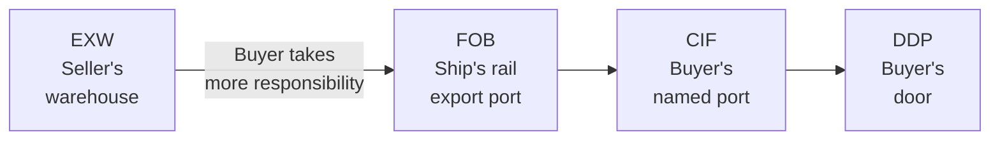

# Import/Export Fundamentals — Module 4: Incoterms & Shipping
**Learner:** Dr. Nazmul Alam, Ph.D.
**Business context:** Eczema-safe halal laundry detergent · AIBS, Petaling Jaya
**Trade corridor:** Malaysia ↔ Canada · Home care & personal care products and raw materials
**Date:** March 2026

---

## 1. Why Incoterms exist

When a buyer and seller agree on a price, that price alone doesn't answer the most important operational questions:

- Who pays for freight from Canada to Malaysia?
- Who pays for marine insurance?
- Who handles export customs in Canada?
- Who handles import customs in Malaysia?
- If goods are damaged at sea — whose loss is it?

Without clear answers, both parties assume the other is responsible — leading to disputes, unexpected costs, and damaged relationships.

**Incoterms** (International Commercial Terms) are a set of standardised trade terms published by the **International Chamber of Commerce (ICC)** that answer all these questions unambiguously.

> **Key principle:** Incoterms define exactly where the seller's responsibility ends and the buyer's responsibility begins — in terms of both **cost** and **risk.**

---

## 2. The four essential Incoterms

### The responsibility spectrum

**Seller pays more → → → → → → Buyer pays more**
`EXW ←————————————————————————→ DDP`

---

### EXW — Ex Works

> *"Come and collect it from our factory. Everything after that is your responsibility."*

| Party | Responsibility |
|---|---|
| **Seller** | Make goods available at their premises. Nothing else. |
| **Buyer** | Everything — truck to export port, export customs, ocean freight, insurance, import customs, delivery to final destination |

**Risk transfers:** At seller's warehouse/factory

**Best for:** Buyers who have strong logistics networks and want maximum control

---

### FOB — Free On Board

> *"We'll get it to the ship and load it. Once it's on board — it's yours."*

| Party | Responsibility |
|---|---|
| **Seller** | Pack goods, truck to export port, export customs, load onto ship |
| **Buyer** | Ocean freight, marine insurance, import customs, delivery to final destination |

**Risk transfers:** The moment goods are loaded on board the ship at the named export port

**Best for:** Experienced importers who want control over freight and insurance costs

> ⚠️ **Precise risk point:** If a drum falls during loading — seller's risk. If it falls after being placed on board — buyer's risk. The word "on board" is legally precise.

---

### CIF — Cost, Insurance, Freight

> *"We'll handle everything until your port. From there — it's yours."*

| Party | Responsibility |
|---|---|
| **Seller** | Everything up to named destination port — freight, insurance included |
| **Buyer** | Import customs, duty, delivery from port to final destination |

**Risk transfers:** At the named destination port (e.g. Port Klang)

**Best for:** Beginner importers — seller handles complexity of international shipping

> Note: Under CIF, the seller arranges insurance — but the **minimum coverage** required is quite basic. For high-value shipments, buyers should consider arranging their own additional insurance even under CIF terms.

---

### DDP — Delivered Duty Paid

> *"We handle everything — including your import customs and duty. It arrives at your door."*

| Party | Responsibility |
|---|---|
| **Seller** | Absolutely everything — including import customs and duty in buyer's country |
| **Buyer** | Simply receive the goods |

**Risk transfers:** At buyer's named destination (e.g. your lab in Shah Alam)

**Best for:** Buyers who want maximum simplicity. Sellers with strong logistics networks in the buyer's country.

---

## 3. Choosing the right Incoterm

### As importer (buying APG from Canada)

| Your experience level | Recommended Incoterm | Reason |
|---|---|---|
| **Beginner (first 3 shipments)** | **CIF Port Klang** | Seller handles freight and insurance complexity |
| **Developing (3–10 shipments)** | **CIF or FOB** | Learning your own freight forwarder relationships |
| **Experienced (10+ shipments)** | **FOB Vancouver** | Full control, lower cost, established systems |

> **Rule:** Start with CIF. Switch to FOB once you've completed 3–4 shipments confidently and have a trusted Malaysian freight forwarder relationship.

### As exporter (selling detergent to Canada)

| Situation | Recommended Incoterm | Reason |
|---|---|---|
| **First export, unknown buyer** | **FOB Port Klang** | You control Malaysia side, buyer controls Canada |
| **Established relationship** | **CIF Vancouver** | Added service justifies premium pricing |
| **Large retail chain** | **DDP** | They may insist on it — price accordingly |

> **Negotiation reality:** Buyers always prefer CIF (seller does more). Sellers always prefer EXW (buyer does more). FOB Port Klang is the practical compromise for first exports.

---

## 4. Incoterm negotiation — the tension

| Party | Preference | Reason |
|---|---|---|
| **Buyer** | CIF | Seller handles complexity |
| **Seller** | EXW | Buyer handles complexity |

**FOB is the compromise** — seller handles their home country, buyer handles their home country.

### Your counter-proposal framework for first Canadian export

| Element | Buyer proposes | Your counter | Your reasoning |
|---|---|---|---|
| Incoterm | CIF Vancouver | FOB Port Klang | Not practical to arrange Canadian freight on first shipment |
| Payment | T/T 30 days after delivery | Sight LC | Unknown buyer, need payment guarantee and immediate cash |

**Professional response template:**
> *"Thank you for your order. We propose FOB Port Klang with payment via Sight Letter of Credit. This is our standard term for new international accounts. Once we establish a trading relationship over 2–3 orders, we are happy to discuss CIF and open account terms."*

---

## 5. Marine cargo insurance

### Why it's non-negotiable
- Sea freight involves real physical risks — storms, container damage, loading accidents, vessel incidents
- Without insurance, a lost or damaged shipment = total financial loss
- Even experienced importers **always** buy marine cargo insurance

### When to arrange insurance
Coverage must begin at the exact point **your risk begins** under the agreed Incoterm:

| Incoterm | Your risk begins | Insurance must start |
|---|---|---|
| EXW | Seller's warehouse | From moment you collect goods |
| FOB | When loaded on board | From loading at export port |
| CIF | At destination port | Seller arranges — verify coverage adequacy |
| DDP | At your door | Seller arranges entire coverage |

> Under CIF — seller arranges minimum coverage. For high-value shipments, always ask: *"Is my cargo covered from point of loading in Canada to delivery at Port Klang?"*

### Types of marine cargo coverage

| Coverage | What it covers | Best for |
|---|---|---|
| **All Risk** | All physical loss and damage | Recommended for your chemical drums |
| **WA (With Average)** | Partial and total loss | Standard coverage |
| **FPA (Free of Particular Average)** | Total loss only | Minimum coverage — avoid for chemicals |

**Recommended for your APG shipments:** All Risk coverage from point of loading to Port Klang delivery.

---

## 6. Working capital gap — the exporter's reality

### What it is
The period between when you **spend money** to fulfill an order and when you **get paid** in full.

### Your first Canadian export order timeline

```mermaid
gantt
    title Working capital gap — 500 unit export order
    dateFormat DD
    section Cash out
    Buy raw materials + OEM    :01, 15d
    section Cash in
    Receive 50% deposit        :01, 1d
    Ship goods FOB             :16, 1d
    Receive 50% balance        :20, 5d
```

**The gap:** You spend RM7,500 on Day 1–15. You only receive full payment around Day 20–25. For 10–20 days you are cash flow negative by approximately RM2,000–3,000.

**Solutions:**
- Collect higher upfront deposit (50% instead of 30%)
- Use Sight LC — bank pays immediately upon shipment documents
- Use AIBS's existing credit lines to bridge the gap
- Apply for **export financing** from EXIM Bank Malaysia

---

## 7. Payment terms — exporter perspective

As seller your T/T structure flips compared to when you're the buyer:

| Role | You are | Preferred structure | Reason |
|---|---|---|---|
| **Buyer** from BASF | Importer | T/T 30/70 (30% upfront) | BASF is trusted multinational |
| **Seller** to Canadian store | Exporter | T/T 50/50 or Sight LC | Unknown buyer, need working capital coverage |

### Sight LC vs Usance LC

| Type | Payment timing | Best for |
|---|---|---|
| **Sight LC** | Immediately upon presentation of correct documents | You as new exporter — need cash immediately |
| **Usance LC** | 30, 60, or 90 days after shipment | Established relationships, buyers need time to sell goods first |

> **Your choice as new exporter:** Always request **Sight LC** for orders above USD 5,000–10,000 with unknown buyers.

### LC threshold — when to use LC vs T/T

| Order value | Recommended payment method |
|---|---|
| Below USD 5,000 | T/T 50/50 — LC costs not justified |
| USD 5,000–15,000 | T/T 50/50 or Sight LC depending on buyer trust |
| Above USD 15,000 | Sight LC — protection essential |

---

## 8. Pricing power — your competitive advantage

Standard commodity exporters have little pricing power — buyers can easily find alternatives.

Your eczema-safe halal detergent has genuine pricing power because:

| Factor | Your advantage |
|---|---|
| **Unique formulation** | PhD-level APG chemistry — no local Canadian equivalent |
| **Halal certification** | JAKIM globally recognised — access to Muslim consumer market |
| **Brand story** | Father of eczema children — authentic, impossible to replicate |
| **Regulatory expertise** | cGMP/GLP background — credible quality claims |
| **No direct competition** | No Malaysian halal eczema detergent brand in Canada currently |

> **Implication:** You have more negotiating leverage on Incoterms and payment terms than a typical new exporter. Use it.

---

## 9. Customs problems — resolution framework

When RMCD holds your shipment, identify the problem type first:

| Problem type | Example | Resolution |
|---|---|---|
| **Documentation error** | HS code mismatch between invoice and CoO | Contact supplier immediately — request corrected documents |
| **Physical discrepancy** | B/L shows 4 drums, packing list shows 3 | Contact freight forwarder — verify with carrier how many drums physically loaded |
| **Valuation dispute** | Customs suspects undervaluation | Present bank payment records + original supplier invoice + market price benchmarks |

### The three-problem framework

**Problem A — HS code mismatch (invoice vs CoO)**
- Both documents from same supplier → supplier's error
- Resolution: Request corrected documents → resubmit to RMCD
- Prevention: Review all documents before ship arrives using Module 3 checklist

**Problem B — Quantity mismatch (B/L vs packing list)**
- Packing list prepared before loading → carrier loaded differently
- Resolution: Verify with carrier → if shortage confirmed → marine insurance claim
- Prevention: Request carrier confirmation of drum count at loading

**Problem C — Customs undervaluation query**
- Resolution: Present bank SWIFT payment records + original invoice + supplier price list
- Key insight: Bank payment records are impossible to fake — strongest proof of genuine value
- Prevention: Ensure declared CIF value exactly matches actual payment made

---

## 10. Key terms — Module 4 glossary

| Term | Definition |
|---|---|
| **Incoterm** | International Commercial Term — standardised rule defining cost and risk responsibilities between buyer and seller |
| **EXW** | Ex Works — seller's minimum responsibility, buyer collects from seller's premises |
| **FOB** | Free On Board — seller responsible until goods loaded on ship at named export port |
| **CIF** | Cost Insurance Freight — seller responsible until goods arrive at buyer's named port |
| **DDP** | Delivered Duty Paid — seller's maximum responsibility, delivers to buyer's door including import duty |
| **Risk transfer** | The precise moment when responsibility for loss or damage passes from seller to buyer |
| **Marine cargo insurance** | Insurance covering physical loss or damage during international transit |
| **All Risk coverage** | Comprehensive marine insurance covering all physical loss and damage |
| **Working capital gap** | Period between spending money to fulfill an order and receiving full payment |
| **Sight LC** | Letter of Credit paid immediately upon presentation of correct documents |
| **Usance LC** | Letter of Credit with deferred payment — 30, 60, or 90 days after shipment |
| **Pricing power** | Ability to maintain premium prices due to unique product positioning |
| **Demurrage** | Daily penalty for uncollected containers beyond free period at port |
| **LCL threshold** | Order size below which LCL (shared container) is more cost-effective than FCL |

---

## 11. Self-test questions

1. Rank EXW, FOB, CIF, DDP from maximum seller responsibility to minimum seller responsibility.
2. Under FOB Vancouver terms, a drum falls during loading. Who bears the loss? What if it fell after loading was complete?
3. You receive two quotes: USD 2,350 EXW Ontario and USD 2,900 CIF Port Klang. How do you decide which is cheaper?
4. You are exporting to Canada for the first time. A buyer proposes CIF Vancouver, T/T 30 days after delivery. What is your counter-proposal and why?
5. Why does a new exporter prefer Sight LC over Usance LC?
6. What is the working capital gap and how does collecting 50% upfront help manage it?
7. Your shipment is held at Port Klang because customs suspects undervaluation. What documents do you present and why?
8. At what order value threshold does it make sense to use LC instead of T/T?

---

## 12. Action items for your business

- [ ] When requesting first APG quote from BASF/Brenntag — specify **CIF Port Klang** as preferred Incoterm
- [ ] Get marine cargo insurance quote — specify **All Risk** coverage, from loading in Canada to Port Klang delivery
- [ ] Contact **EXIM Bank Malaysia** — enquire about export financing facilities for working capital gap
- [ ] Prepare standard export price list in **USD** — include all FOB Port Klang costs (COGS + OEM + export freight + documentation + margin)
- [ ] When first Canadian buyer approaches — propose **FOB Port Klang + Sight LC** as standard first-order terms
- [ ] Calculate your **minimum viable order size** for Canadian export — below what order value does export complexity exceed profit?

---

*Notes prepared as part of: Import/Export Fundamentals — Malaysia ↔ Canada*
*Business context: Eczema-Safe Halal Laundry Detergent under AIBS Sdn Bhd*
*Previous module: Module 3 — Trade Documentation*
*Next module: Module 5 — Regulatory Compliance (JAKIM, NPRA, Health Canada)*
