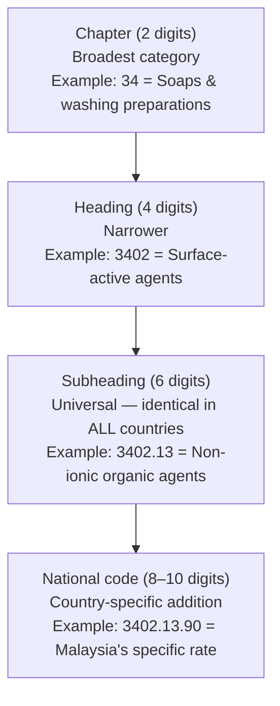
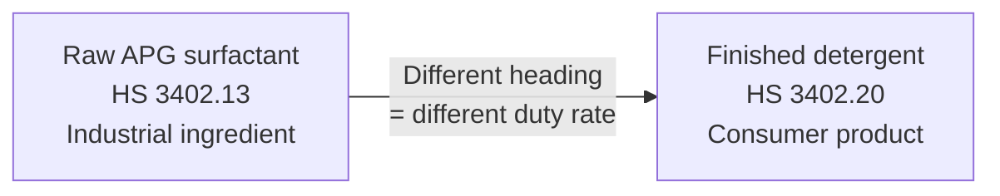
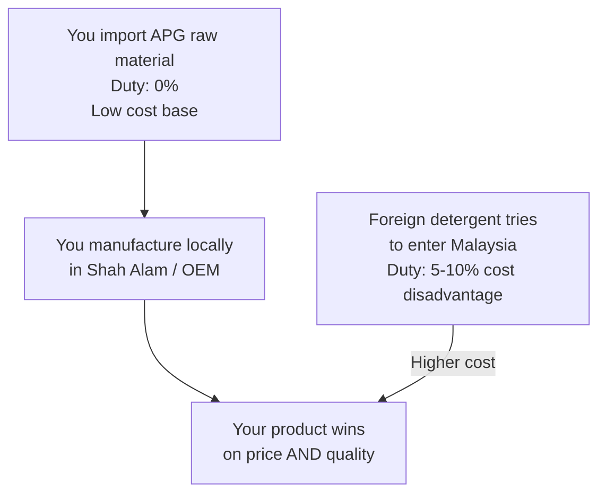

# Import/Export Fundamentals — Module 2: Customs, HS Codes & Duties
**Learner:** Dr. Nazmul Alam, Ph.D.
**Business context:** Eczema-safe halal laundry detergent · AIBS, Petaling Jaya
**Trade corridor:** Malaysia ↔ Canada · Home care & personal care products and raw materials
**Date:** March 2026

---

## 1. The core problem customs solves

When a shipment arrives at Port Klang, the customs officer needs to answer three questions:

1. **What exactly is this product?** → Solved by the HS Code
2. **How much import duty should I charge?** → Solved by the Tariff Schedule
3. **Are there any restrictions on importing this?** → Solved by the HS Code + regulatory database

A text description like *"liquid surfactant, plant-derived, for industrial use"* is not enough — it could describe hundreds of different products with different duty rates. Customs needs a **universal, unambiguous number.**

> **Your chemistry parallel:** Just as CAS numbers uniquely identify chemical compounds for chemists, HS codes uniquely identify products for customs officers — except HS codes work for *everything* traded globally, not just chemicals.

---

## 2. The HS Code system

### What it is
**HS** = Harmonized System — created by the **World Customs Organization (WCO)**, used by **200+ countries** including Malaysia and Canada.

Every physical product traded internationally has an HS code. Bananas have one. Helicopters have one. Your APG surfactant has one.

### Structure — like biological taxonomy



| Level | Digits | Scope | Example |
|---|---|---|---|
| Chapter | 2 | Broadest | 34 = Soaps, washing preparations |
| Heading | 4 | Narrower | 3402 = Surface-active agents |
| Subheading | 6 | **Universal — same in all 200+ countries** | 3402.13 = Non-ionic organic agents |
| National code | 8–10 | Country-specific | 3402.13.90 = Malaysia rate code |

> ⚠️ **Critical rule:** The first 6 digits are identical in every country. The last 2–4 digits vary by country. Always verify the full national code for both Malaysia AND Canada separately.

### Analogy for your background
Think of HS codes like biological classification:

| Biology | HS Code |
|---|---|
| Kingdom | Chapter (2 digits) |
| Phylum | Heading (4 digits) |
| Class/Order | Subheading (6 digits) |
| Species | National code (8–10 digits) |

---

## 3. HS codes for your specific products

### Your formulation ingredients

| Product | HS Code | Description | Notes |
|---|---|---|---|
| Decyl Glucoside (APG) | **3402.13** | Non-ionic organic surface-active agents | Your primary surfactant |
| Coco Glucoside (APG) | **3402.13** | Non-ionic organic surface-active agents | Your co-surfactant |
| Finished liquid detergent | **3402.20** | Preparations put up for retail sale | Your finished product |
| Glycerin (vegetable) | **1520.00** | Glycerol, crude or refined | Humectant in formulation |
| Phenoxyethanol | **2909.49** | Ether-alcohols and their derivatives | Preservative |
| Xanthan Gum | **3913.90** | Natural polymers modified | Thickener |
| Sodium Citrate | **2918.15** | Citrates | Builder/chelant |
| Sodium Bicarbonate | **2836.30** | Sodium bicarbonate | Alkalinity agent |

### Why raw material vs finished product classification matters



**Same Chapter 34 — but different headings = different duty rates.** This is intentional government policy.

---

## 4. Import duty structure — what you actually pay

### The three components

```
Total import cost = Customs Duty + SST + Miscellaneous fees
```

| Component | What it is | Rate (typical) |
|---|---|---|
| **Customs Duty** | Tax on imported goods, calculated on CIF value | 0–30% depending on HS code |
| **SST** (Sales & Service Tax) | Malaysia's consumption tax | 5–10% for consumer goods, 0% for industrial inputs |
| **Miscellaneous** | Port charges, agent fees, storage | RM150–500 per shipment |

### How customs value (CIF) is calculated

> **CIF = Cost + Insurance + Freight**

This is important — duty is charged on **CIF value**, not just the product cost.

**Example:** 100kg Decyl Glucoside from Canada

```
Cost of goods (ex-works Canada)    = RM 2,350
+ Freight (sea, LCL)               = RM   300
+ Marine insurance                 = RM    50
─────────────────────────────────────────────
CIF Value                          = RM 2,700

Customs Duty  = RM2,700 × 0%      = RM     0
SST           = exempt (industrial) = RM     0
Port/agent fees                    = RM   200
─────────────────────────────────────────────
Total landed cost                  = RM 2,900
```

---

## 5. Malaysia's duty rates — your products

| Product | HS Code | Customs Duty | SST | Notes |
|---|---|---|---|---|
| APG surfactants (raw) | 3402.13 | **0%** | **Exempt** | Industrial raw material — zero tax burden |
| Finished detergent (import) | 3402.20 | **5–10%** | **5%** | Protects local manufacturers |
| Glycerin | 1520.00 | 0% | Exempt | Widely available locally |
| Phenoxyethanol | 2909.49 | 5% | Exempt | Verify with MCFTA for China source |
| Xanthan Gum | 3913.90 | 0–5% | Exempt | Verify with MCFTA for China source |

> **Strategic insight:** The Malaysian government charges 0% on raw materials but 5–10% on finished imported detergent. This is **Infant Industry Protection** — deliberately designed to encourage local manufacturing. Your business model is directly supported by this policy.

---

## 6. Trade policy concept — Infant Industry Protection

### What it is
A government strategy where:
- **Low or zero duty** on raw materials → manufacturers import cheaply
- **Higher duty** on finished imported products → foreign competitors have a cost disadvantage
- **Result:** Local manufacturing is encouraged, jobs are created, industry develops

### Applied to your business



**The government's trade policy is actively working in your favour.**

---

## 7. Malaysia's trade agreements — your complete toolkit

### What a free trade agreement (FTA) does
An FTA between two countries reduces or eliminates customs duty on goods traded between them. Each product's rate is determined by its HS code in the agreement's tariff schedule.

> ⚠️ **Important:** FTAs affect **customs duty only** — they do not affect SST, which is a domestic tax controlled solely by Malaysia.

### Key distinction — FTAs are **not** uniform
Each country negotiates its own schedule. Malaysia's commitments to Canada and Canada's commitments to Malaysia can be — and often are — **different rates and different timelines.**

Always check **both directions** separately:
- Malaysia importing from Country X → Malaysia's schedule
- Malaysia exporting to Country X → that country's schedule

### Malaysia's FTAs relevant to your business

| Agreement | Full name | Countries | Relevance |
|---|---|---|---|
| **CPTPP** | Comprehensive and Progressive Agreement for Trans-Pacific Partnership | Canada, Japan, Australia, Vietnam, Singapore + 6 others | APG imports from Canada, finished detergent exports to Canada |
| **MCFTA** | Malaysia-China Free Trade Agreement | China | Phenoxyethanol, xanthan gum, packaging |
| **AIFTA** | ASEAN-India Free Trade Agreement | India | Glycerin (India is major palm glycerin producer) |
| **AKFTA** | ASEAN-South Korea FTA | South Korea | Specialty chemicals, packaging |
| **AFTA** | ASEAN Free Trade Area | All 10 ASEAN members | Regional expansion — Indonesia, Singapore, Thailand |

---

## 8. CPTPP — your Malaysia-Canada specific tool

### Member countries
Malaysia, Canada, Japan, Australia, New Zealand, Singapore, Vietnam, Brunei, Chile, Mexico, Peru

### How it helps your business — two directions

**Direction 1: You importing from Canada (raw materials)**

| Product | Standard duty | CPTPP duty | Saving |
|---|---|---|---|
| APG surfactants | 0% | 0% | No additional benefit (already zero) |
| Specialty chemicals | 5% | 0% | Save 5% on CIF value |

**Direction 2: You exporting to Canada (finished detergent)**

| Product | Canada standard duty | Canada CPTPP duty | Your advantage |
|---|---|---|---|
| Finished detergent (3402.20) | 6.5% | 0% | 6.5% cost advantage vs non-CPTPP competitors |

> **Real number example:** Export shipment of RM50,000 finished detergent to Canada
> - Without CPTPP: Canadian buyer pays 6.5% = RM3,250 extra duty
> - With CPTPP: RM0 duty
> - **Your competitive advantage: RM3,250 per RM50,000 shipment**

### How to use the CPTPP tariff finder
1. Go to: [https://www.tariffinder.ca](https://www.tariffinder.ca) (Canada) or MITI portal (Malaysia)
2. Enter the HS code of your product
3. Select exporting country (Malaysia) and importing country (Canada)
4. Read the specific CPTPP rate and staging timeline

---

## 9. Your formulation — complete sourcing & duty map

| Ingredient | Best source | Trade agreement | Duty outlook |
|---|---|---|---|
| Decyl Glucoside | Malaysia (BASF/KLK) or Canada | Local / CPTPP | 0% ✅ |
| Coco Glucoside | Malaysia (KLK Oleo, Sime Darby) | Local | 0% — no import needed ✅ |
| Glycerin | Malaysia / India | Local / AIFTA | 0–5% ✅ |
| Phenoxyethanol | China (Symrise) / Europe (BASF) | MCFTA if China | 0–5% — verify ⚠️ |
| Xanthan Gum | China (dominant global supplier) | MCFTA | 0–5% — verify ⚠️ |
| Sodium Citrate | Local distributors / China | Local / MCFTA | 0% ✅ |
| Sodium Bicarbonate | Local (widely available) | Local | 0% ✅ |
| Packaging (HDPE) | Malaysia / China | Local / MCFTA | Verify ⚠️ |

> **Key finding:** The majority of your formulation has zero or near-zero import duty. Your COGS calculations in the business plan (RM8–14/L) are realistic from a duty perspective.

---

## 10. How to verify an HS code — step by step

Never guess an HS code. An incorrect code can result in wrong duty payment, customs delays, or penalties.

### Step 1 — Use Malaysia's official portal
- **MySST portal:** [https://mysst.customs.gov.my](https://mysst.customs.gov.my)
- **JKDM (Customs) tariff search:** [https://tariff.customs.gov.my](https://tariff.customs.gov.my)

### Step 2 — Cross-check with Canada
- **Canada Tariff Finder:** [https://www.tariffinder.ca](https://www.tariffinder.ca)
- Enter the 6-digit universal subheading — both countries should recognize it

### Step 3 — Verify with your freight forwarder
Your freight forwarder classifies goods professionally. Always share your product's:
- Chemical name (INCI)
- CAS number
- Intended use (industrial raw material vs consumer product)
- Physical form (liquid, powder, solid)

### Step 4 — Get a Binding Tariff Ruling (if high value)
For large regular shipments, you can apply to RMCD for an **Advance Ruling** — an official written confirmation of the correct HS code. This protects you from future disputes.

---

## 11. Certificate of Origin (CoO) — claiming FTA rates

To claim CPTPP or any FTA preferential duty rate, your goods must be accompanied by a **Certificate of Origin (CoO)** proving the goods genuinely originate from the FTA member country.

### For your APG import from Canada
- Your Canadian supplier must provide a **CPTPP Certificate of Origin**
- Issued by: Export Development Canada or authorized Canadian trade body
- Must state: HS code, origin criteria met, exporter declaration

### Rules of Origin — the key concept
FTA duty benefits only apply if goods **genuinely originate** from the member country. A product cannot be simply shipped *through* Canada from China to claim CPTPP rates. The goods must meet **Rules of Origin** criteria — typically:
- Wholly obtained in the country, OR
- Substantially transformed (enough manufacturing done locally)

---

## 12. Key terms — Module 2 glossary

| Term | Definition |
|---|---|
| **HS Code** | Harmonized System code — universal product classification number used by 200+ countries |
| **Chapter** | First 2 digits of HS code — broadest product category |
| **Heading** | First 4 digits — narrower category |
| **Subheading** | First 6 digits — universal across all countries |
| **CIF** | Cost + Insurance + Freight — the value on which customs duty is calculated |
| **Customs Duty** | Tax charged by the importing country's government on imported goods |
| **SST** | Sales and Service Tax — Malaysia's domestic consumption tax (not affected by FTAs) |
| **FTA** | Free Trade Agreement — treaty reducing duties between member countries |
| **CPTPP** | Malaysia-Canada free trade agreement (among 11 countries) |
| **MCFTA** | Malaysia-China Free Trade Agreement |
| **CoO** | Certificate of Origin — document proving where goods were made, required to claim FTA rates |
| **Rules of Origin** | Criteria goods must meet to qualify as "originating" from an FTA member country |
| **Infant Industry Protection** | Trade policy of low raw material duties + higher finished goods duties to encourage local manufacturing |
| **Tariff Schedule** | The complete table of all HS codes and their duty rates for a given country |
| **Binding Tariff Ruling** | Official RMCD decision confirming the correct HS code for your specific product |

---

## 13. Self-test questions

1. What do the first 6 digits of an HS code represent, and why are they significant internationally?
2. Your APG surfactant has HS code 3402.13 and your finished detergent has HS code 3402.20. Both are in Chapter 34. Why do they have different duty rates?
3. Explain "Infant Industry Protection" in one sentence and give one example from your business.
4. You want to export finished detergent to Canada. How does CPTPP help you compared to a competitor from a non-CPTPP country?
5. What is CIF and why is duty calculated on CIF value rather than just the product cost?
6. What document do you need from your Canadian supplier to claim CPTPP preferential duty rates?
7. Can CPTPP reduce your SST liability in Malaysia? Why or why not?
8. You find a phenoxyethanol supplier in Germany. Germany is not in CPTPP or MCFTA. What duty rate framework applies?

---

## 14. Action items for your business

- [ ] Confirm HS code **3402.13** with your freight forwarder for APG surfactant import
- [ ] Confirm HS code **3402.20** for your finished detergent export classification
- [ ] Look up phenoxyethanol (HS 2909.49) duty rate under MCFTA on JKDM portal
- [ ] When sourcing from Canada — request CPTPP Certificate of Origin from all suppliers
- [ ] Register on [tariff.customs.gov.my](https://tariff.customs.gov.my) and practice looking up your ingredients
- [ ] Ask your freight forwarder to confirm HS codes before first shipment

---

*Notes prepared as part of: Import/Export Fundamentals — Malaysia ↔ Canada*
*Business context: Eczema-Safe Halal Laundry Detergent under AIBS Sdn Bhd*
*Previous module: Module 1 — The Big Picture*
*Next module: Module 3 — Trade Documentation*
