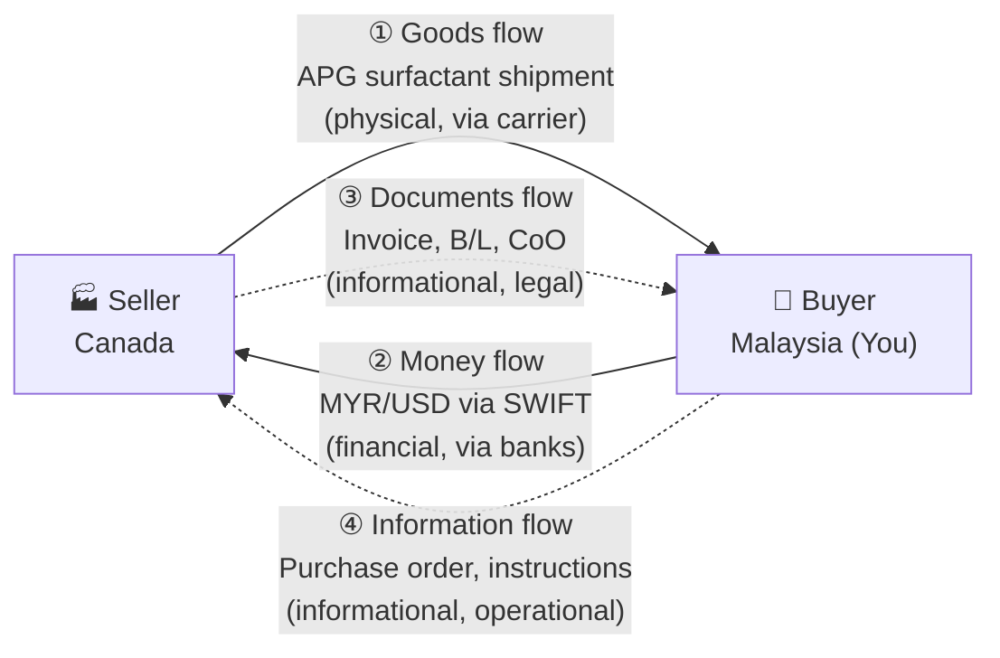
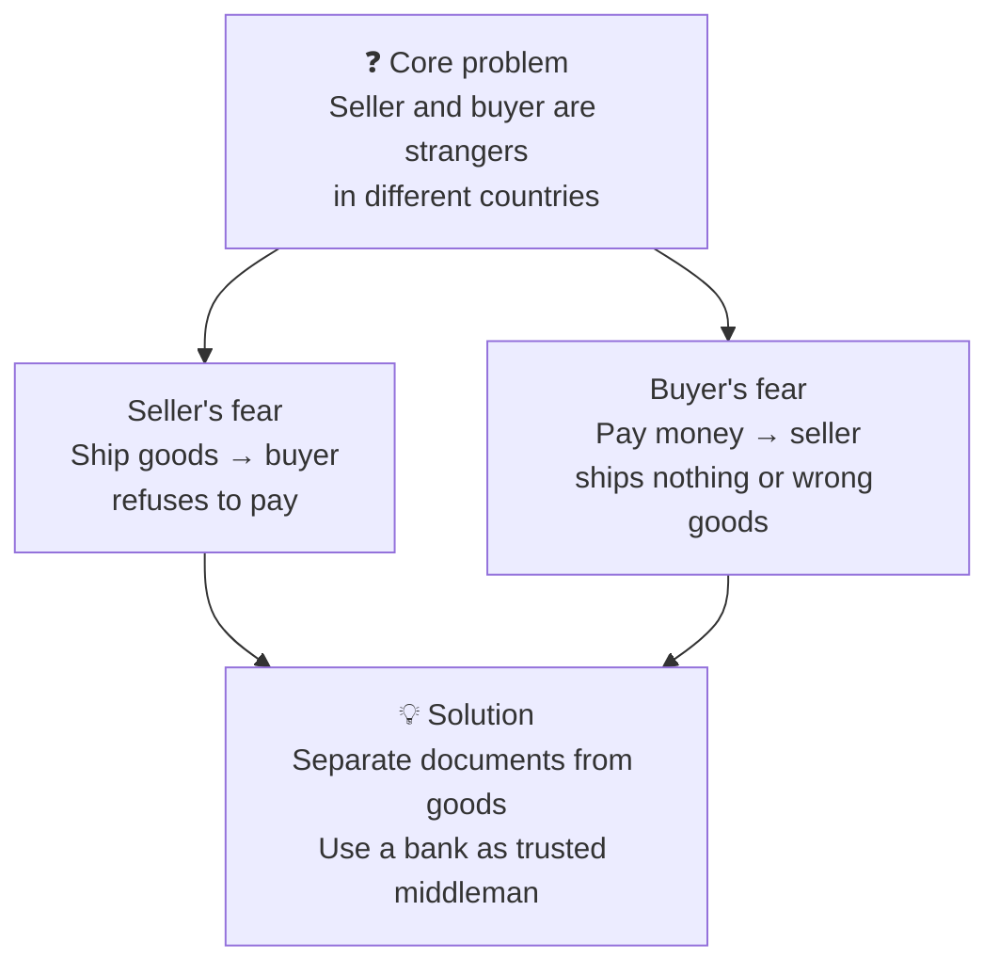
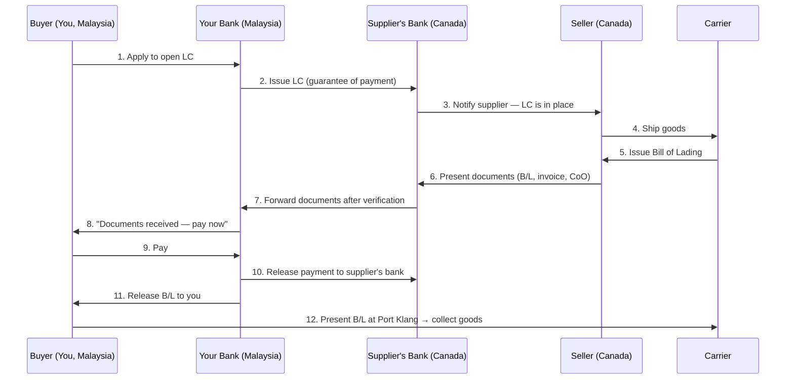

# Import/Export Fundamentals — Module 1: The Big Picture
**Learner:** Dr. Nazmul Alam, Ph.D.
**Business context:** Eczema-safe halal laundry detergent · AIBS, Petaling Jaya
**Trade corridor:** Malaysia ↔ Canada · Home care & personal care products and raw materials
**Date:** March 2026

---

## 1. Why international trade is different from local purchasing

When you ordered chemicals as a scientist from a local vendor, the process was simple:
- Place order → receive goods → pay invoice

International trade is fundamentally harder because:
- **Buyer and seller are strangers** in different countries with different legal systems
- **Physical goods, money, and documents** travel separately and at different speeds
- **Two governments** (both countries' customs) are involved
- **Currency differences** create exchange rate risk
- **Distance** means problems are expensive to fix

> **Key insight:** Every concept in import/export exists to solve one of these problems.

---

## 2. The key players

| Player | What they do | Real example (your business) |
|---|---|---|
| **Seller / Exporter** | Makes and ships the goods | BASF Canada — APG surfactant supplier |
| **Buyer / Importer** | Receives and pays for goods | You (Dr. Alam) / AIBS, Shah Alam |
| **Freight Forwarder** | Arranges the whole shipment on your behalf — books carrier, prepares documents, handles customs | Your most important trade relationship |
| **Carrier** | Actually owns and operates the ship or plane | Maersk, CMA CGM (you rarely deal with them directly) |
| **Customs Authority** | Government body that inspects goods, collects duties, enforces import/export rules | Malaysia: **RMCD** (Royal Malaysian Customs Department) · Canada: **CBSA** (Canada Border Services Agency) |
| **Banks** | Facilitate payment and provide financial guarantees | Your Malaysian bank + supplier's Canadian bank |
| **Marine Insurer** | Covers physical loss or damage during transit | Allianz, Tokio Marine etc. |

> **Tip:** Always hire a **freight forwarder** — they are your guide through the entire process. A good forwarder saves you more money than they cost.

---

## 3. The 4 flows of every trade transaction

Every international trade transaction has exactly four things moving simultaneously:

| Flow | Direction | What it contains | Who handles it |
|---|---|---|---|
| **① Goods** | Seller → Buyer | Physical shipment | Carrier + Freight forwarder |
| **② Money** | Buyer → Seller | Payment in agreed currency | Banks via SWIFT |
| **③ Documents** | Seller → Buyer | Invoice, B/L, Certificate of Origin | Freight forwarder + Banks |
| **④ Information** | Both directions | Orders, instructions, confirmations | Buyer + Seller directly |

> **Critical insight:** Documents (③) and goods (①) travel **separately** and often arrive at different times. This separation is intentional — it is the foundation of trade security.

---

## 4. The Bill of Lading (B/L) — the most important document in trade

### What it is
A **Bill of Lading** is issued by the carrier when they receive the goods. It is simultaneously:
- A **receipt** — proof the carrier received the goods
- A **contract** — between shipper and carrier
- A **title document** — legal proof of ownership of the cargo

### Why it matters
> **Whoever holds the original B/L owns the cargo.** The port will NOT release goods without it.

### Types of B/L
| Type | Description | When used |
|---|---|---|
| **Original B/L** | Physical paper document, negotiable | High-value shipments, LC transactions |
| **Telex Release / Express B/L** | Electronic surrender — no paper needed | Trusted partners, fast transactions |
| **Seaway Bill** | Non-negotiable — cannot be used as title | Regular shipments between trusted parties |

---

## 5. The core problem of international trade

---

## 6. The Letter of Credit (LC) — the banker's solution

### What it is
A **Letter of Credit** is a formal written guarantee from a bank that says:
> *"I (the bank) will pay the seller — but ONLY if the seller presents documents proving they shipped exactly what was agreed."*

### How it works step by step

### Who is protected and how

| Party | Fear | How LC protects them |
|---|---|---|
| **Seller** | Buyer won't pay | Bank guarantees payment regardless of buyer's behavior |
| **Buyer** | Seller ships wrong goods | Bank only pays if documents match agreed specifications exactly |

### Important limitation of LC
> ⚠️ **The bank checks documents, NOT physical goods.** A fraudulent seller could technically present perfect documents for an incorrect shipment. This is why supplier vetting (below) is essential.

---

## 7. Supplier vetting — before you open any LC

Because an LC doesn't fully protect against fraud or poor quality, you must vet suppliers **before** committing to any transaction.

### Vetting methods (from desk, without traveling)

| Method | Trade term | Tool / Resource |
|---|---|---|
| LinkedIn background check | **Company due diligence** | LinkedIn, company website, news search |
| Google reviews + user feedback | **Reputation research** | Google, industry forums, trade associations |
| Feedback from other buyers | **Trade references** | Ask supplier for 2–3 customer references, call them |
| Friend or contact overseas | **Local agent / in-country contact** | Personal network, trade chambers |
| Video call with supplier team | **KYC — Know Your Counterparty** | Zoom/Teams — verify real people, real facility |
| Formal credit report | **Business Credit Report** | **Dun & Bradstreet (D&B)** — every registered company has a D-U-N-S number |

### Dun & Bradstreet (D&B) explained
- **D-U-N-S number** = unique 9-digit identifier assigned to every registered business globally
- A D&B report gives you: payment history, financial stability score, legal disputes, trade references
- Banks and large corporations **require** this before extending credit to new partners
- Cost: USD 50–200 per report depending on depth
- Website: [dnb.com](https://www.dnb.com)

### Reactive protections (after vetting)
| Tool | What it covers | When it applies |
|---|---|---|
| **Marine Cargo Insurance** | Physical loss or damage during transit | All shipments — always get this |
| **Third Party Inspection (TPI)** | Independent verification of goods before shipment | New suppliers, high-value orders |
| **Pre-shipment inspection certificate** | Document proving goods were inspected | Required by some buyers and some countries |

---

## 8. Applied to your business — APG surfactant import

### Your transaction profile
| Element | Detail |
|---|---|
| **Product** | Decyl Glucoside + Coco Glucoside (APG surfactants) |
| **Supplier** | BASF Canada / Brenntag Canada |
| **Buyer** | AIBS Sdn Bhd (under which your brand operates) |
| **Route** | Canada → Port Klang, Malaysia |
| **Currency** | USD (international chemical trade standard) |
| **Freight type** | Sea freight (LCL — Less than Container Load for small initial orders) |

### Recommended vetting checklist for your first Canadian supplier
- [ ] Search company on D&B — verify D-U-N-S number
- [ ] Request 2 trade references from Malaysian/Asian buyers
- [ ] Video call with sales manager AND technical team
- [ ] Request Certificate of Analysis (CoA) for sample batch
- [ ] Order small sample (1–5kg) before committing to full order
- [ ] Verify RSPO certification for palm-derived APG (important for your halal positioning)
- [ ] Check if they have experience exporting to Malaysia (RMCD familiarity)

---

## 9. Key terms — quick reference glossary

| Term | Definition |
|---|---|
| **Exporter** | Seller who sends goods out of their country |
| **Importer** | Buyer who receives goods into their country |
| **Freight Forwarder** | Agent who arranges the entire shipment on your behalf |
| **Carrier** | Company that physically transports goods (ship, airline) |
| **RMCD** | Royal Malaysian Customs Department |
| **CBSA** | Canada Border Services Agency |
| **Bill of Lading (B/L)** | Document issued by carrier — acts as receipt, contract, and title to goods |
| **Letter of Credit (LC)** | Bank guarantee of payment, conditional on correct documents |
| **SWIFT** | International banking network used to transfer money between countries |
| **D-U-N-S number** | Dun & Bradstreet unique business identifier — used for credit checks |
| **Marine Cargo Insurance** | Insurance covering goods during international transit |
| **KYC** | Know Your Counterparty — process of verifying who you're dealing with |
| **LCL** | Less than Container Load — sharing a container with other shippers (used for small orders) |
| **FCL** | Full Container Load — you fill an entire container (used for larger orders) |

---

## 10. What's coming in Module 2

In Module 2 you will learn:
- What an **HS Code** is and how to find the right one for your products
- How **import duty rates** are calculated
- Malaysia's **SST** and Canada's **GST/HST** on imported goods
- How **CPTPP** (the free trade agreement between Malaysia and Canada) can **reduce or eliminate** your import duties
- Applied specifically to: APG surfactants, finished detergent, packaging materials

---

## Self-test questions

Test yourself before moving to Module 2:

1. Name the 4 flows of an international trade transaction and give one example of each from your APG import scenario.
2. What is a Bill of Lading and why can't the port release goods without it?
3. Explain how an LC protects the seller. Then explain its limitation.
4. You find a new APG supplier in Ontario, Canada on a trade directory. List 5 things you would verify before placing an order.
5. What is the difference between a freight forwarder and a carrier?
6. What does D-U-N-S stand for and which company issues it?

---

*Notes prepared as part of: Import/Export Fundamentals — Malaysia ↔ Canada*
*Business context: Eczema-Safe Halal Laundry Detergent under AIBS Sdn Bhd*
*Next module: Module 2 — Customs, HS Codes & Duties*
