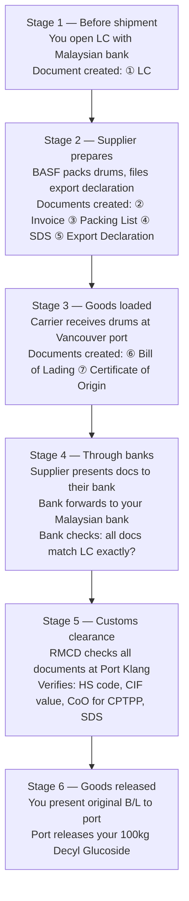

# Import/Export Fundamentals — Module 3: Trade Documentation
**Learner:** Dr. Nazmul Alam, Ph.D.
**Business context:** Eczema-safe halal laundry detergent · AIBS, Petaling Jaya
**Trade corridor:** Malaysia ↔ Canada · Home care & personal care products and raw materials
**Date:** March 2026

---

## 1. Why documentation is the backbone of international trade

Unlike local purchasing where a simple invoice and payment suffice, international trade requires multiple documents because:

- **Different legal systems** — each country has its own rules
- **Strangers across distance** — buyer and seller cannot verify each other easily
- **Multiple parties** — banks, customs, carriers, freight forwarders all need information
- **Government oversight** — both countries' governments need to know what crosses their borders
- **Risk management** — documents create legally enforceable obligations at each step

> **Key principle:** Every document in a shipment serves a specific audience and solves a specific problem. Understanding *why* a document exists makes it impossible to forget.

---

## 2. Invoice vs receipt — the fundamental distinction

This distinction causes more confusion than almost anything else in trade:

| Document | Timing | Purpose | Obligation |
|---|---|---|---|
| **Invoice** | Issued before or at point of sale | States what is owed | Creates legal obligation to pay |
| **Receipt** | Issued after payment | Confirms payment received | Closes the obligation |

> **Restaurant analogy:** The bill the waiter brings = invoice (you still owe). The card machine receipt = receipt (obligation settled).

In international trade you deal almost exclusively with **invoices** — payment happens separately through banking systems. You rarely see a traditional receipt.

---

## 3. The Commercial Invoice — the master document

### Why it's called the master document
Every other document in a shipment references the Commercial Invoice. It serves **four audiences simultaneously:**

| Audience | What they need | Why |
|---|---|---|
| **Bank** | Product, quantity, price, timing | To verify LC conditions are met before releasing payment |
| **Customs (RMCD)** | HS code + CIF value | To calculate correct import duty |
| **Freight forwarder** | Delivery address, package details, weight | To arrange logistics and delivery |
| **You as buyer** | Everything | To verify you received exactly what you ordered |

### Required fields on a Commercial Invoice for your APG import

| Field | Example for your shipment |
|---|---|
| Seller name and address | BASF Canada Inc, Ontario |
| **Buyer name and address** | **AIBS Sdn Bhd, Kelana Jaya, PJ** |
| Invoice number and date | INV-2026-001, March 2026 |
| **HS Code** | **3402.13** |
| Product description (INCI) | Decyl Glucoside, APG surfactant |
| CAS number | 68515-73-1 |
| Quantity | 100kg (4 drums × 25kg) |
| Unit price | USD 23.50/kg |
| Total value | USD 2,350.00 |
| **Incoterm** | **FOB Vancouver** or CIF Port Klang |
| Payment terms | 30% T/T advance, 70% T/T against B/L |
| Country of origin | Canada |

> ⚠️ **Critical rule:** The buyer name must be the **legal entity** — always **AIBS Sdn Bhd**, never Dr. Nazmul Alam personally. A name mismatch between invoice and LC causes payment to be held.

---

## 4. The complete document set — your APG shipment

### All 8 documents explained

| # | Document | Prepared by | Purpose | Audience |
|---|---|---|---|---|
| ① | **Letter of Credit** | Your Malaysian bank | Payment guarantee to seller | Supplier's bank |
| ② | **Commercial Invoice** | Supplier (BASF Canada) | Master transaction record | Bank, customs, forwarder, you |
| ③ | **Packing List** | Supplier | Physical contents of each package | Freight forwarder, customs |
| ④ | **Safety Data Sheet (SDS)** | Supplier / manufacturer | Chemical safety, hazard information | Customs, port authority, you |
| ⑤ | **Export Declaration (CAED)** | Canadian freight forwarder | Notifies Canadian government of export | CBSA (Canadian customs) |
| ⑥ | **Bill of Lading (B/L)** | Carrier (shipping line) | Legal title to goods | Supplier → bank → you → port |
| ⑦ | **Certificate of Origin (CoO)** | Supplier (self-certified for CPTPP) | Proves Canadian origin for CPTPP rates | RMCD customs |
| ⑧ | **Marine Insurance Certificate** | Your insurer | Covers loss/damage during transit | You, bank |

### The Packing List — often overlooked but critical
Many beginners confuse the Packing List with the Commercial Invoice. Key differences:

| Commercial Invoice | Packing List |
|---|---|
| Financial document — states value | Physical document — states contents |
| Used for duty calculation | Used for physical verification |
| Has prices | Has no prices |
| Bank needs this | Port/customs needs this |

For your APG shipment:
- Invoice says: *"100kg Decyl Glucoside, USD 2,350"*
- Packing list says: *"4 drums, each 25kg net / 28kg gross, Drum dimensions: 45cm × 60cm"*

### The SDS — your chemistry advantage
As a PhD chemist you've worked with SDS documents your entire career. In trade context:
- **Old name:** MSDS (Material Safety Data Sheet) — some suppliers still use this
- **Required for:** All chemical imports into Malaysia — no SDS = customs will not release shipment
- **Contains:** Chemical properties, hazard classification, handling requirements, emergency procedures
- **Who checks it:** RMCD customs, port authority, your freight forwarder

> For Decyl Glucoside specifically: Low hazard classification, non-toxic, biodegradable — SDS process is straightforward. Always verify against Malaysia's Poison Act 1952 and Environmental Quality Act for each new chemical.

---

## 5. The document flow — sequence and timing

### Why timing matters
- Sea freight Canada → Malaysia: **3–4 weeks**
- Documents via courier/banking: **5–7 days**
- Documents arrive **weeks before** the ship

This timing gap is intentional and critical. If goods arrived before documents:
- Port cannot release cargo without B/L
- Container sits at port accumulating **demurrage charges**
- Port Klang demurrage: **RM300–800 per day per container**
- A 2-week delay = potentially RM4,000–11,000 in penalties

### The 6-stage document flow

> **The golden rule:** LC opens the chain. B/L closes it. Every document in between must be consistent.

---

## 6. Documentary discrepancy — the silent killer

A documentary discrepancy occurs when any detail on one document doesn't exactly match another document.

### Common discrepancies that hold up payments

| Discrepancy type | Example | Consequence |
|---|---|---|
| Name mismatch | Invoice says "Dr. Nazmul" vs LC says "AIBS Sdn Bhd" | Bank refuses payment |
| Quantity mismatch | Invoice: 100kg, Packing list: 98kg | Customs query, payment held |
| HS code mismatch | Invoice: 3402.13, CoO: 3402.20 | CPTPP claim rejected |
| Date discrepancy | B/L dated after LC expiry | Entire LC invalidated |
| Description mismatch | Invoice: "surfactant", LC: "Decyl Glucoside" | Bank query, delay |

> ⚠️ **Even a spelling mistake can hold up your shipment.** "Kelana Jaya" vs "Kelana jaya" — banks and customs systems are unforgiving.

### Your document review checklist — before releasing 70% T/T payment

- [ ] **Party names** — AIBS Sdn Bhd appears identically on all documents
- [ ] **HS code** — 3402.13 appears on invoice and matches CoO
- [ ] **Quantity** — 100kg matches across invoice, packing list, and B/L
- [ ] **Price** — CIF value correct, matches agreed terms
- [ ] **CoO validity** — CPTPP declaration complete with origin criterion stated
- [ ] **Shipping marks** — drum count on packing list matches B/L exactly
- [ ] **Shipment date** — B/L date within agreed shipment window

---

## 7. Payment terms — choosing the right structure

### The payment methods compared

| Method | How it works | Risk to buyer | Risk to seller | Best for |
|---|---|---|---|---|
| **LC** | Bank guarantees payment against documents | Low | Low | New suppliers, large orders, high value |
| **T/T in advance** | 100% payment before shipment | High | None | Fully trusted suppliers only |
| **T/T 30/70** | 30% deposit + 70% on documents | Medium | Low | New suppliers, medium orders |
| **T/T against documents** | 100% payment after receiving docs | Low-medium | Medium | Established relationships |
| **Open account** | Pay after receiving goods | None | High | Long-term trusted partners |

### Recommended structure for your first APG order

> **30% T/T advance + 70% T/T against B/L copy**

Written in trade shorthand: *"30% T/T advance, 70% T/T against shipping documents"*

| Payment | Timing | Rationale |
|---|---|---|
| 30% deposit | Before shipment | Shows you're serious, covers supplier's production cost |
| 70% balance | Upon receiving B/L copy | B/L proves shipment happened, fair to both parties |

### Why not LC for first small order?
- LC setup cost: RM500–1,500 (expensive relative to small first order)
- Processing time: 7–14 days vs T/T clearing in 1–3 days
- BASF and Brenntag are multinational corporations — fraud risk essentially zero
- Complexity of LC documentation unnecessary for established suppliers

### Why Option B (pay on documents) for the 70% balance?
| Option | Problem |
|---|---|
| Pay on physical arrival | Ship takes 3–4 weeks — supplier waits too long, unfair |
| **Pay on documents** ✅ | Documents prove shipment — reasonable protection, fair timing |
| Pay after lab inspection | Could take weeks — no supplier would accept |

---

## 8. Certificate of Origin — deeper understanding

### Three purposes (not just CPTPP)

| Purpose | Detail |
|---|---|
| **CPTPP preferential duty** | Primary use — claims 0% duty for eligible products |
| **Country of origin marking** | Required on product/packaging in some markets |
| **Import quota tracking** | Some countries limit imports from specific origins |

### CPTPP self-certification — how it works
Unlike traditional CoOs requiring a government stamp, CPTPP uses **exporter self-certification:**

The supplier declares origin directly on the Commercial Invoice or a separate declaration. No government stamp required — but the declaration must contain specific fields:

| Required field | What to check |
|---|---|
| Exporter name and address | Must match invoice exactly |
| Importer name | Must be AIBS Sdn Bhd |
| HS code | Must be 3402.13 |
| **Origin criterion** | **Most important field — must state "A" (wholly obtained) or "B" (tariff shift)** |
| Date | Must be within shipment period |
| Authorized signature | Must be signed by authorized person |

> ⚠️ **If the origin criterion field is vague or missing — reject the document immediately and request a corrected version.**

### CoO verification — three layers

**Layer 1 — Document check**
Verify all required CPTPP fields are present and correctly completed.

**Layer 2 — Supplier audit trail**
Request supporting manufacturing evidence:
- Raw material purchase invoices
- Production records
- Proof of genuine Canadian manufacturing

**Layer 3 — Official verification**
If suspicious, RMCD can send official verification request to CBSA who checks directly with the exporter.

### Record keeping requirement
Keep ALL origin documentation for **minimum 5 years** — RMCD can audit your CPTPP claims retroactively.

---

## 9. LCL shipments — special considerations

For your initial small orders (100–200kg), you will use **LCL (Less than Container Load)** — sharing container space with other importers.

### LCL-specific risks

| Risk | Detail | Mitigation |
|---|---|---|
| **Shared container delay** | Other importers' document problems can delay your cargo | Ensure your documents are perfect — you can't control others |
| **Consolidation time** | Freight forwarder consolidates multiple shipments — adds 2–5 days | Factor this into delivery timeline |
| **Higher per-kg cost** | You pay for space used, not whole container | Accept this cost for small orders — move to FCL when volume justifies |

> **Rule of thumb:** LCL for orders under 10 cubic meters (CBM). FCL becomes cost-effective above 15 CBM.

---

## 10. SDS and chemical import compliance

### Malaysia chemical import checklist for Decyl Glucoside

| Requirement | Status | Authority |
|---|---|---|
| SDS (16-section GHS format) | Required ✅ | RMCD / DOSH |
| Poison Act 1952 | Not scheduled ✅ | Pharmacy Board Malaysia |
| Environmental Quality Act 1974 | Not scheduled waste ✅ | DOE Malaysia |
| REACH compliance (if EU origin) | N/A for Canada | EU only |
| Canadian Export Control List | Not controlled ✅ | CBSA Canada |

> Always verify each new chemical separately — do not assume because one APG is clear, all APGs are clear.

---

## 11. Key terms — Module 3 glossary

| Term | Definition |
|---|---|
| **Commercial Invoice** | Master trade document stating all transaction details — used by bank, customs, forwarder, and buyer |
| **Packing List** | Physical contents document — no prices, states dimensions, weights, package count |
| **Bill of Lading (B/L)** | Carrier-issued document — receipt, contract, and legal title to goods |
| **SDS** | Safety Data Sheet — chemical safety document required for all chemical imports |
| **MSDS** | Material Safety Data Sheet — old name for SDS, still used by some suppliers |
| **Export Declaration** | Filing with exporting country's customs declaring what is leaving the country |
| **CAED** | Canadian Automated Export Declaration — Canada's electronic export filing system |
| **Marine Insurance Certificate** | Document proving cargo is insured during transit |
| **Documentary Discrepancy** | Any mismatch between documents — can hold up payment or shipment |
| **Demurrage** | Daily penalty charged by port for containers not collected within free period |
| **T/T** | Telegraphic Transfer — international wire payment via SWIFT banking network |
| **LCL** | Less than Container Load — sharing container space with other shippers |
| **FCL** | Full Container Load — exclusive use of entire container |
| **Origin Criterion** | Field on CPTPP CoO stating why goods qualify as originating (A = wholly obtained, B = tariff shift) |
| **Free Period** | Days allowed to collect container from port before demurrage begins (typically 3–7 days) |

---

## 12. Self-test questions

1. What are the four audiences of a Commercial Invoice and what does each need from it?
2. What is the difference between a Commercial Invoice and a Packing List?
3. Why do documents travel separately from goods — and what financial risk arises if documents are delayed?
4. Your supplier sends you documents for review before you release the 70% T/T balance. List 7 things you would check.
5. Why is T/T 30/70 more appropriate than an LC for your first small APG order from BASF Canada?
6. What is demurrage and how would you avoid it?
7. The origin criterion field on your CPTPP CoO is blank. What do you do?
8. You are importing Decyl Glucoside via LCL. Another importer's documents in the same container have a problem. How does this affect you?

---

## 13. Action items for your business

- [ ] Brief your freight forwarder: always use **AIBS Sdn Bhd** as buyer name on all documents
- [ ] Create a **document checklist template** based on Section 11 above — use for every shipment
- [ ] Request **sample documents** (invoice, packing list, CoO) from BASF/Brenntag Canada before first order — verify format matches requirements
- [ ] Confirm your supplier can provide **GHS-format SDS** for Decyl Glucoside and Coco Glucoside
- [ ] Get marine cargo insurance quote from **Allianz Malaysia or Tokio Marine** before first shipment
- [ ] Set up a **document filing system** — physical or digital — keep all trade documents minimum 5 years
- [ ] Ask your Malaysian freight forwarder about **Port Klang free period** and demurrage rates

---

## 14. The three-module summary — what you now know

> *International trade is not the same as local purchasing. It involves a great number of documents, parties, and checks because of different country rules, safety requirements, dealing with strangers across distances, and managing risk at every step. But once you understand the mechanism behind each document and each rule — it becomes a systematic, learnable process.*
> — Dr. Nazmul Alam, March 2026

---

*Notes prepared as part of: Import/Export Fundamentals — Malaysia ↔ Canada*
*Business context: Eczema-Safe Halal Laundry Detergent under AIBS Sdn Bhd*
*Previous module: Module 2 — Customs, HS Codes & Duties*
*Next module: Module 4 — Incoterms & Shipping*
