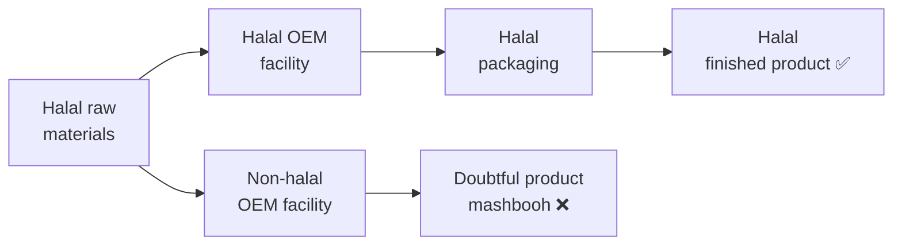
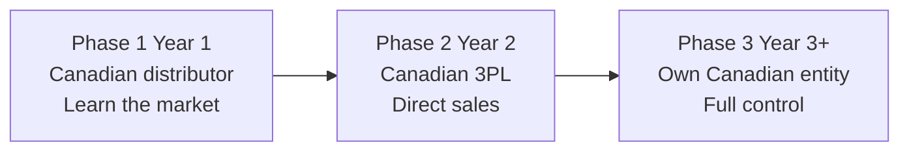

# Import/Export Fundamentals — Module 5: Regulatory Compliance
**Learner:** Dr. Nazmul Alam, Ph.D.
**Business context:** Eczema-safe halal laundry detergent · AIBS, Petaling Jaya
**Trade corridor:** Malaysia ↔ Canada · Home care & personal care products and raw materials
**Date:** March 2026

---

## 1. Why regulatory compliance matters in international trade

Regulatory compliance is not just a legal obligation — it is a **market access requirement.** Without the right certifications and documentation:

- Malaysian retailers won't stock your product
- Canadian distributors won't carry your product
- Muslim consumers won't trust your product
- Banks won't finance your export shipments
- Customs won't release your goods

> **Key principle:** Compliance is not a cost — it's an investment in market access. Your PhD chemistry background gives you a significant advantage in understanding and navigating these requirements.

---

## 2. Product classification — the foundation of everything

Before any regulatory requirement applies, your product must be correctly classified. Classification determines which regulations govern your product in each market.

### Malaysia classification

| Classification | Examples | Regulatory pathway |
|---|---|---|
| **Detergent / consumer product** | Laundry detergent, dish soap | Consumer Protection Act 1999, MS 2633:2018 |
| **Cosmetic** | Skincare, haircare, personal care | NPRA notification required |
| **Scheduled chemical** | Controlled substances | Additional permits required |

> **Your product:** Laundry detergent → consumer product category → **no NPRA notification required** ✅

### Canada classification

| Classification | Examples | Regulatory body |
|---|---|---|
| **Consumer chemical product** | Laundry detergent, cleaning products | Health Canada — CCPSA |
| **Cosmetic** | Skincare, personal care | Health Canada — Cosmetic Regulations |
| **Drug** | Therapeutic products | Health Canada — Food and Drugs Act |
| **Natural health product** | Vitamins, herbal remedies | Health Canada — NHPR |

> **Your product:** Laundry detergent → consumer chemical product → **CCPSA applies** ✅

---

## 3. The claims framework — most critical strategic decision

**Classification follows the claim — not the formula.** The exact wording on your label and marketing materials determines your regulatory category.

### The three claim types

| Claim type | Example | Regulatory category | Risk |
|---|---|---|---|
| **Cosmetic/consumer claim** | "Gentle formula, free from irritants" | Consumer product | Low ✅ |
| **Structure/function claim** | "Formulated for eczema-prone skin" | Grey area | Medium ⚠️ |
| **Drug/therapeutic claim** | "Treats eczema flare-ups" | Drug | High ❌ |

### Safe vs dangerous claims — your product

| Safe to claim ✅ | Avoid ⚠️ |
|---|---|
| Free from SLS, SLES, synthetic fragrance | Treats eczema |
| Formulated for eczema-prone skin | Clinically proven to reduce flare-ups |
| pH balanced, near-neutral formula | Recommended for eczema patients |
| Plant-derived, biodegradable ingredients | Dermatologist prescribed |
| Halal certified, no animal derivatives | Clinically tested (without supporting data) |
| PhD chemist formulated | Medical grade |
| Free from 6 known skin irritants | Cures or prevents eczema |

### The negative claim strategy — your most powerful tool

> Instead of claiming what your product **does** (risky) — claim what it **doesn't contain** (safe).

**"Free from SLS, SLES, synthetic fragrance, enzymes, dyes, optical brighteners"** is:
- Legally safe in both Malaysia and Canada
- Scientifically verifiable — your PhD credibility supports it
- Extremely compelling to eczema parents who read ingredient lists
- Impossible for competitors to challenge
- Used successfully by CeraVe, Cetaphil, Aveeno globally

---

## 4. Malaysia regulatory framework

### 4.1 JAKIM Halal Certification — most important Malaysian requirement

#### Why halal certification is commercially essential
- 60%+ of Malaysian population is Muslim
- Required by major retailers: Guardian, Watsons, Giant, Aeon
- Required by Shopee and Lazada Malaysia for certain product categories
- JAKIM certification is globally recognised — supports future ASEAN and Middle East export

#### Halal integrity — the supply chain principle
Your product is only as halal as its **weakest link** in the entire supply chain:

> **Key rule:** Even 100% halal ingredients become **mashbooh** (doubtful) if manufactured in a non-halal certified facility. Always require halal-certified OEM.

#### Halal ingredient analysis — your formulation

| Ingredient | Halal concern | Solution |
|---|---|---|
| **Decyl Glucoside** | Plant-derived — glucose + palm/coconut fatty alcohol | No concern ✅ |
| **Coco Glucoside** | Plant-derived — coconut origin | No concern ✅ |
| **Glycerin** | Can be animal or plant-derived | Specify **vegetable glycerin** — request CoA confirming plant origin |
| **Phenoxyethanol** | Synthetic — petrochemical origin. Concerns: manufacturing impurities, tayyib status | Request halal declaration confirming no haram-derived catalysts or solvents in manufacturing |
| **Xanthan Gum** | Bacterial fermentation — potential trace ethanol byproduct | Request halal certificate confirming ethanol removed during purification |
| **Sodium Citrate** | Synthetic — no concern | ✅ |
| **Sodium Bicarbonate** | Mineral — no concern | ✅ |
| **Sodium Chloride** | Mineral — no concern | ✅ |

> **Halal due diligence tip:** Identify and resolve ingredient halal risks BEFORE applying to JAKIM. This prevents months of back-and-forth during document review stage.

#### JAKIM certification process

| Stage | What happens | Your action | Timeline |
|---|---|---|---|
| **1 — Application** | Submit via MYeHALAL portal | Company registration, product details, complete ingredient list | Day 1 |
| **2 — Document review** | JAKIM checks all ingredient documentation | Provide halal declarations for all 8 ingredients | 4–6 weeks |
| **3 — On-site audit** | JAKIM auditor visits OEM facility | Ensure OEM has valid halal certificate, clean facility, segregated storage | Scheduled by JAKIM |
| **4 — Committee decision** | JAKIM halal committee reviews audit report | Wait | 2–4 weeks |
| **5 — Certificate issued** | Valid 3 years, renewable | Display on packaging, website, Shopee listing | — |

**Total timeline:** 15–30 working days if all documents complete. In practice: **2–4 months** for first-time applicants.
**Cost:** RM2,000–5,000 including preparation costs.
**Portal:** MYeHALAL — [myehalal.gov.my](https://www.myehalal.gov.my)

#### JAKIM OEM facility requirements
Your OEM must have a **Halal Assurance System (HAS)** covering:
- Dedicated halal production lines OR documented cleaning validation between runs
- Halal-trained staff handling your product
- Segregated halal ingredient storage
- Documented halal procedures for receiving, processing, packaging

> **Why Pro-Chem (Seri Kembangan) is your top OEM choice:** Already halal-certified — eliminates the biggest halal compliance risk immediately.

### 4.2 Consumer Protection Act 1999

**Mandatory label requirements for Malaysian market:**

| Element | Requirement |
|---|---|
| Product name | Clear and accurate |
| Ingredient list | INCI names |
| Net quantity | Metric units (ml or g) |
| Manufacturer details | AIBS Sdn Bhd name and address |
| Batch number | For traceability |
| Manufacturing/expiry date | Shelf life indication |
| Usage instructions | Clear directions in BM and/or English |
| Warnings | Any applicable safety warnings |
| **Language** | **Bahasa Malaysia and/or English** |

### 4.3 Environmental Quality Act 1974 (DOE Malaysia)

Your APG formulation already meets DOE requirements — by design:

| Requirement | Standard | Your product |
|---|---|---|
| Surfactant biodegradability | >80% in 28 days | APG >90% in 28 days (OECD 301B) ✅ |
| No phosphates | Prohibited | Using sodium citrate instead ✅ |
| Aquatic toxicity | Must meet limits | APG — excellent aquatic safety profile ✅ |

> **Strategic insight:** Your biodegradability data serves double duty — **regulatory compliance AND marketing claim.** "Biodegrades in 28 days" is both a DOE requirement and a powerful eco-friendly selling point.

### 4.4 MS 2633:2018 — Malaysian Standard for Detergents

Malaysia's national standard for detergent products. Key requirements:
- pH within safe range (your 7.5–8.0 already compliant)
- Microbiological limits (your stability protocol addresses this)
- Labeling requirements (covered above)
- Performance standards

---

## 5. Canadian regulatory framework

### 5.1 Canada Consumer Product Safety Act (CCPSA)

Canada's primary legislation for consumer products including laundry detergent.

**Key principle:** Canada uses a **self-assessment** model — no pre-market approval required. You are responsible for ensuring your product is safe and compliant before sale.

**CCPSA requirements for your detergent:**

| Requirement | Detail | Your action |
|---|---|---|
| Product safety | Must not pose unreasonable danger | APG formula — inherently safe ✅ |
| Incident reporting | Report any consumer injury incidents to Health Canada | Set up incident tracking system |
| Record keeping | Maintain safety documentation for 10 years | File all stability and safety data |
| Label compliance | Meet all labeling requirements | See Section 5.3 |

### 5.2 Health Canada — Cosmetic Regulations (if applicable)

If any of your products cross into cosmetic territory (body wash, hand soap in Phase 2/3):
- **Cosmetic Notification Form (CNF)** — filed within **10 days of first sale** in Canada
- Filed online through Health Canada's portal
- No pre-market approval needed — notification only
- List all ingredients by INCI name and concentration range

> **Your experience advantage:** You filed cosmetic notifications at Deciem. You know this process better than most new exporters.

### 5.3 Canadian label requirements — CCPSA

**Critical requirement:** All consumer product labels must be **bilingual — English AND French.**

| Required element | Detail |
|---|---|
| Product identity | Name and general description |
| Net quantity | Metric units |
| **Canadian importer address** | **Mandatory — your Canadian distributor's address** |
| Ingredient list | INCI names |
| Directions for use | Clear usage instructions |
| Warnings | Any applicable hazard warnings |
| **Bilingual text** | **English AND French — non-negotiable** |

**Translation cost:** CAD 50–150 one-time per label version
**Translation providers:** Lionbridge, TransPerfect, certified freelance translators

> ⚠️ **Most common mistake by Malaysian exporters:** Submitting English-only labels. Rejected immediately by Canadian distributors and retailers.

### 5.4 Safety Data Sheet (SDS) — Canadian requirements

- Must follow **GHS format — 16 sections**
- Must be available in **English and French**
- Must be provided to any Canadian buyer on request
- Your supplier provides SDS for raw materials — you need one for your **finished product**

### 5.5 Canadian halal certification — voluntary

| Aspect | Detail |
|---|---|
| Government requirement | None — voluntary system |
| Major certifiers | IFANCC, HMA, ISNA Canada, CIVIH |
| JAKIM recognition | Globally recognised — accepted by most Canadian Muslim consumers |
| Strategy | Use JAKIM certificate initially — add Canadian certification when retailer requests it |
| Cost | CAD 500–2,000 annually |
| Timeline | 4–8 weeks |

**Canadian Muslim market opportunity:**
- 1.8 million Muslims in Canada
- Fastest growing demographic
- Zero halal-certified laundry detergents from Malaysian brands currently
- Your JAKIM certificate is a genuine first-mover advantage

---

## 6. Canadian market entry structure

### The importer of record problem
Canadian labels must show a Canadian importer address. As a Malaysian manufacturer you need a Canadian presence.

**Three options:**

| Option | Cost | Complexity | Best for |
|---|---|---|---|
| **Canadian distributor** | Distribution margin (25–35%) | Low — they handle everything | Phase 1 — first export ✅ |
| **Canadian 3PL warehouse** | Storage + handling fees | Medium | Phase 2 — direct sales |
| **Own Canadian entity** | CAD 500–2,000 setup + ongoing | High | Phase 3 — established revenue |

**Recommended progression:**

### Target Canadian distributor profile
- Carries natural/organic home care products
- Has existing relationships with health food stores and pharmacies
- Understands Muslim consumer market or sensitive skin niche
- Located in Ontario or British Columbia (largest Muslim populations)

**Examples:** Nature's Best Distribution (BC), Horizon Natural Products (Ontario)

---

## 7. Product liability insurance — both markets

### What it covers
Legal and financial costs if your product causes consumer harm — allergic reactions, injuries, property damage, and resulting lawsuits.

### Why it's essential for your specific product
You market specifically to eczema patients — people with compromised skin barriers. This creates higher liability exposure than a standard detergent.

### Coverage requirements

| Market | Minimum coverage | Annual premium |
|---|---|---|
| **Malaysia** | RM1,000,000 | RM2,000–4,000 |
| **Canada** | CAD 2,000,000 | CAD 1,200–2,500 |

> **Canadian distributor requirement:** Most require minimum CAD 2,000,000 coverage with them named as **additional insured** on your policy.

### Your scientific documentation as legal protection
Your stability testing protocol — 40°C accelerated testing, freeze-thaw cycling, microbiological limits, pH monitoring — is not just good science. It is your **legal defence** if anyone claims your product caused harm.

Document everything. Keep records for minimum 10 years.

---

## 8. Complete regulatory timeline — your business

### Priority order (start immediately)

```mermaid
gantt
    title Regulatory timeline — eczema-safe detergent launch
    dateFormat MM
    section Immediate
    Trademark filing MyIPO        :01, 2M
    section Month 1-2
    Halal ingredient due diligence :01, 2M
    section Month 2-4
    JAKIM application and audit    :02, 3M
    Product liability insurance    :02, 1M
    section Month 3-5
    Canadian label design bilingual :03, 2M
    Canadian distributor approach   :04, 3M
    section Month 6+
    Optional Canadian halal cert    :06, 2M
```

### Malaysia launch checklist

- [ ] **File trademark via MyIPO** — Class 3, RM950 — START NOW, 8–14 month timeline
- [ ] Collect halal declarations for all 8 ingredients — especially glycerin, phenoxyethanol, xanthan gum
- [ ] Confirm OEM (Pro-Chem or Jasanga) halal certification status
- [ ] Apply for JAKIM via MYeHALAL portal
- [ ] Ensure labels comply with Consumer Protection Act 1999
- [ ] Confirm biodegradability data meets DOE requirements
- [ ] Obtain product liability insurance — minimum RM1,000,000

### Canada export checklist

- [ ] Design bilingual English/French labels from day one
- [ ] Obtain GHS-format SDS for finished product — bilingual
- [ ] Identify and approach Canadian natural health distributor
- [ ] Negotiate distributor agreement — ensure their address on Canadian labels
- [ ] Obtain product liability insurance with Canadian coverage — CAD 2,000,000 minimum
- [ ] Confirm JAKIM certificate accepted by Canadian distributor (usually yes)
- [ ] Consider Canadian halal certification once distributor confirmed

---

## 9. Key terms — Module 5 glossary

| Term | Definition |
|---|---|
| **JAKIM** | Jabatan Kemajuan Islam Malaysia — Malaysian government halal certification authority |
| **MYeHALAL** | JAKIM's online halal certification portal |
| **Halal** | Permissible under Islamic law |
| **Tayyib** | Pure and wholesome — second dimension of halal beyond mere permissibility |
| **Mashbooh** | Doubtful — uncertain halal status, should be avoided |
| **Halal Assurance System (HAS)** | OEM facility's documented halal management system |
| **NPRA** | National Pharmaceutical Regulatory Agency — governs cosmetics in Malaysia (not detergents) |
| **CCPSA** | Canada Consumer Product Safety Act — governs consumer products including detergents |
| **CNF** | Cosmetic Notification Form — Health Canada filing required within 10 days of first cosmetic sale in Canada |
| **GHS** | Globally Harmonized System — international standard for SDS format and hazard classification |
| **Negative claim** | Marketing claim stating what a product does NOT contain — safest claim strategy |
| **Drug claim** | Therapeutic claim implying product treats a medical condition — triggers drug regulation |
| **Product liability insurance** | Insurance covering legal costs if product causes consumer harm |
| **Importer of record** | Legal entity responsible for import compliance — their address on Canadian label |
| **IFANCC** | Islamic Food and Nutrition Council of Canada — major Canadian halal certifier |
| **MS 2633:2018** | Malaysian Standard for detergent products |
| **Additional insured** | Party added to an insurance policy — Canadian distributors typically require this |

---

## 10. Self-test questions

1. Why does your laundry detergent not require NPRA notification in Malaysia — but would require it if you launched a body wash?
2. What is the difference between a cosmetic claim, a structure/function claim, and a drug claim? Give one example of each for your product.
3. Why is "free from SLS, SLES, synthetic fragrance" a safer claim than "recommended for eczema patients"?
4. Your xanthan gum supplier cannot provide a halal certificate. What are your options?
5. Your OEM manufacturer is not halal certified. Can your finished product receive JAKIM certification? Why or why not?
6. What does Canada's CCPSA require that most Malaysian exporters miss on their first attempt?
7. Why is your JAKIM certificate actually more rigorous than most Canadian halal certifications?
8. A Canadian distributor asks you for product liability insurance documentation. What coverage amount do they typically require and why?
9. What is the single regulatory action with the longest lead time — and why should you start it today?

---

## 11. The PhD advantage in regulatory compliance

Your scientific background creates advantages most entrepreneurs don't have:

| Your background | Regulatory advantage |
|---|---|
| Analytical chemistry PhD | Understand ingredient safety at molecular level |
| Deciem regulatory experience | Know cosmetic notification process firsthand |
| cGMP/GLP/FDA compliance | Stability documentation is second nature |
| Formulation from first principles | Compliance built into formula, not retrofitted |
| Understanding of tayyib concept | Navigate halal nuances beyond basic certification |

> *"Most entrepreneurs learn compliance after launching. You designed compliance into your product before it existed."*

---

*Notes prepared as part of: Import/Export Fundamentals — Malaysia ↔ Canada*
*Business context: Eczema-Safe Halal Laundry Detergent under AIBS Sdn Bhd*
*Previous module: Module 4 — Incoterms & Shipping*
*Next module: Module 6 — Finding Suppliers & Buyers*
