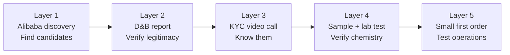
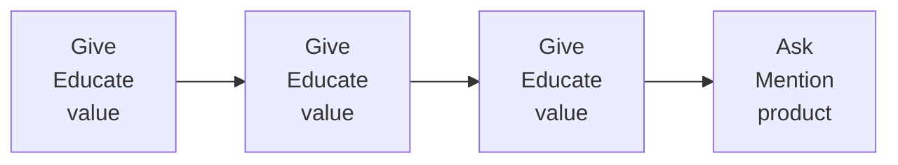

# Import/Export Fundamentals — Module 6: Finding Suppliers & Buyers
**Learner:** Dr. Nazmul Alam, Ph.D.
**Business context:** Eczema-safe halal laundry detergent · AIBS, Petaling Jaya
**Trade corridor:** Malaysia ↔ Canada · Home care & personal care products and raw materials
**Date:** March 2026

---

## 1. The two sides of trade — supplier discovery and buyer discovery

Every import/export business has two equally important skills:

| Skill | Direction | Your context |
|---|---|---|
| **Supplier discovery** | Finding who to buy from | APG surfactants from Canada or China |
| **Buyer discovery** | Finding who to sell to | Malaysian eczema parents, Canadian health stores |

> **Key insight:** The best supplier or buyer you'll ever find is one that someone you trust has already worked with. Personal referrals eliminate 80% of vetting work instantly.

---

## 2. Finding suppliers — the four discovery channels

### Channel 1 — Personal network (most powerful)
Your Canadian professional network from Deciem and Dalriada is one of your most valuable business assets. A trusted referral to a chemical supplier is worth more than any directory listing.

**Action:** Contact former colleagues in Canadian chemical industry — ask specifically about APG surfactant distributors they've worked with.

### Channel 2 — Trade directories

| Directory | Coverage | Best for |
|---|---|---|
| **Thomas Net** (thomasnet.com) | North American industrial | Canadian chemical distributors |
| **Alibaba** (alibaba.com) | Global, Asia-focused | Chinese APG manufacturers |
| **Global Sources** | Asia-focused B2B | Chinese industrial suppliers |
| **Made-in-China.com** | Chinese manufacturers | Factory-direct sourcing |
| **Kompass** | Global B2B | Verified company profiles |
| **ICIS** | Chemical industry | Price benchmarking, supplier intelligence |

### Channel 3 — Trade shows

| Show | Location | Relevance |
|---|---|---|
| **in-cosmetics** | Rotating globally | APG surfactants, personal care ingredients |
| **ICIS World Surfactants Conference** | Europe/USA | Surfactant industry specifically |
| **Supply Side West** | Las Vegas | Personal care raw materials |
| **CHEMSPEC** | Europe | Specialty chemicals |

> **Trade show vs scientific conference:** Trade shows are commercial events — every conversation has a buying or selling purpose. Prepare a target supplier list before attending. Follow up within 48 hours.

### Channel 4 — Government trade resources (most underused)

| Agency | Country | Service | Cost |
|---|---|---|---|
| **MATRADE** | Malaysia | Export market development, buyer matching, trade missions | Free/subsidised |
| **SME Corp** | Malaysia | Supplier development, market access support | Free |
| **Trade Commissioner Service (TCS)** | Canada | Connects Malaysian buyers with Canadian suppliers | **Free** |
| **Export Development Canada (EDC)** | Canada | Financing, insurance, buyer introductions | Free |

> **High value action:** Email Canada's Trade Commissioner in Kuala Lumpur — ask for vetted Canadian APG surfactant distributors. This is a free government service specifically designed for this purpose.

---

## 3. Canadian vs Chinese APG sourcing — comparison

### The reality of Canadian APG supply
BASF Canada and Brenntag Canada are primarily **distributors** of European or Asian-manufactured APG — meaning the product likely originates elsewhere anyway. Canada is not a significant APG manufacturer.

### Head-to-head comparison

| Factor | Canada (Brenntag/BASF) | China (direct manufacturer) | Winner |
|---|---|---|---|
| Price per kg | Higher — distributor margins | Lower — direct from manufacturer | China |
| Distance/freight | 15,000km, 3–4 weeks | 3,500km, 1–2 weeks | China |
| Documentation | CPTPP — simpler | MCFTA — verify HS code | Canada |
| Trust/vetting | Established multinationals | Requires thorough vetting | Canada |
| Manufacturing reality | Distributes Asian-made APG | Actual production origin | China |
| Supply chain risk | Single-region dependency | Diversification available | Balanced |

### Recommended sourcing strategy

| Phase | Source | Reason |
|---|---|---|
| **Phase 1 — Now** | Chinese manufacturer direct | Lowest cost, fastest setup, MCFTA rates |
| **Phase 2 — Year 2** | Dual source China + Brenntag Canada | Supply chain diversification |
| **Phase 3 — Year 3+** | Canadian manufacturing partner | CPTPP value chain optimization |

> **Supply chain concentration risk:** Never source 100% of any critical ingredient from a single country. COVID-19 demonstrated that single-source dependency can paralyse production completely. Always maintain minimum two suppliers from different geographic regions.

---

## 4. The 5-layer China supplier qualification process

Even after finding a Chinese supplier, never skip any qualification layer:

### Layer 1 — Alibaba filter criteria (minimum requirements)
- ✅ Verified Supplier badge — independently audited factory
- ✅ Trade Assurance enabled — Alibaba payment protection
- ✅ On-site check completed — physical factory visit
- ✅ Minimum 3 years on platform
- ✅ Response rate above 90%

> ⚠️ **Critical distinction:** Gold Supplier = paid marketing badge (means nothing). Verified Supplier = independently audited factory (means something). Never confuse the two.

### Layer 2 — D&B business credit report
- Obtain D-U-N-S number for supplier
- Review: payment history, financial stability, legal disputes, trade references
- Cost: USD 50–200 per report
- Website: dnb.com

### Layer 3 — KYC video call
- Video call with both sales AND technical team
- Verify real people, real facility
- Ask technical questions only a genuine manufacturer can answer
- Request live factory tour via video if possible

### Layer 4 — Sample + independent laboratory testing
Request 100–500g sample before any commercial order. Test independently at:

| Lab | Location | Capability |
|---|---|---|
| **Intertek Malaysia** | PJ/KL | Full chemical analysis, GMP certified |
| **SGS Malaysia** | Port Klang | Chemical testing, international recognition |
| **SIRIM QAS** | Shah Alam | Malaysian national testing body |

**What to test for APG surfactants:**

| Test | What it verifies |
|---|---|
| HPLC assay | Active ingredient purity — is it genuinely Decyl Glucoside at stated % |
| Heavy metals | Lead, arsenic, mercury — critical for skin-contact adjacent applications |
| Microbiological | TPC, yeast, mould — especially for aqueous solutions |
| pH | Stability indicator, batch consistency |
| Appearance/colour | Visual batch consistency |

> **Your PhD advantage:** Most importers hire an analytical chemist to interpret lab results. You ARE the analytical chemist. You can read HPLC chromatograms, interpret heavy metals reports, and spot fraudulent CoAs — saving thousands in consulting fees while protecting your formulation quality.

### Layer 5 — Small first commercial order
Even after passing layers 1–4, always start small (25–50kg).

**Why lab testing alone is insufficient:**
The lab test verifies chemistry is correct. The small first order verifies operational reliability:
- On-time delivery
- Correct packaging and labeling
- Accurate shipping documentation
- Responsive communication when problems arise
- Consistent quality batch to batch

> **Incremental supplier qualification:** Small order → verify → medium order → verify → full scale. Never scale before you validate.

---

## 5. Finding Canadian buyers — the distribution strategy

### The distributor model

For Canadian market entry, a Canadian distributor is your most practical Phase 1 approach:

| Role | Distributor handles | You handle |
|---|---|---|
| **Logistics** | Import customs, warehousing, delivery to retailers | Manufacturing, export customs |
| **Market access** | Retail relationships, store placements | Product development, brand building |
| **Compliance** | Canadian import documentation | Product safety compliance, labeling |
| **Finance** | Credit risk with retailers | Working capital for production |

**Distribution margin:** 25–35% of wholesale price

### Channel conflict management — critical concept
> If your distributor places your product in Healthy Planet stores — never direct Canadian consumers to buy directly from your website. This **undermines your distributor's investment** and damages the relationship.

**Instead — use a "Where to Buy" strategy:**
- Your website and social media create consumer demand
- Direct consumers to retail locations where distributor has placed your product
- Example: *"Available at Healthy Planet stores across Ontario — find your nearest store at healthyplanet.com"*
- Result: You do marketing at your cost, distributor gets the sale, they push your product harder

### The pull strategy — most important concept in export marketing

> **Pull strategy:** Create consumer demand directly so retailers and distributors are pulled toward your product — rather than pushing your product onto reluctant distributors.

**How it works for CORENAT in Canada:**
1. Build Instagram following among Canadian eczema parents
2. They ask their local health stores: *"Do you carry CORENAT?"*
3. Health store calls your distributor: *"Can you supply this?"*
4. Distributor is motivated — consumer demand already exists
5. You get better shelf placement, more distributor attention

**Pull strategy is especially powerful for:**
- Niche products with passionate communities
- New unknown brands without advertising budget
- Products requiring trust before purchase

### Target Canadian retail channels

| Channel | Examples | Entry difficulty |
|---|---|---|
| **Natural health chains** | Healthy Planet, Nature's Emporium, Organic Garage | Medium — perfect product fit |
| **Pharmacy chains** | Shoppers Drug Mart, Rexall, London Drugs | High — established brands preferred |
| **Online marketplaces** | Amazon.ca, Well.ca | Low — good starting point |
| **Grocery naturals** | Loblaws, Whole Foods Canada | Medium-high |

### Canadian market entry progression

| Phase | Channel | Action |
|---|---|---|
| **Phase 1** | Canadian distributor + Amazon.ca | Establish market presence |
| **Phase 2** | Natural health chains via distributor | Scale with proven demand |
| **Phase 3** | Own Canadian entity, direct relationships | Full market control |

---

## 6. Finding Malaysian buyers — go-to-market strategy

### Phase 1 — Digital foundation (start here)

**Your three content pillars — no competitor can authentically replicate these:**

| Pillar | Identity | Hook | Content type |
|---|---|---|---|
| **The Father** | Eczema parent of 5 years | *"I have been suffering with my kids for more than 5 years with their eczema, with my experience, I tried to identify root causes"* | Personal journey, emotional resonance |
| **The Scientist** | PhD analytical chemist | *"I wanted to put only necessary ingredients that do not affect skin sensitivity"* | Educational, ingredient transparency |
| **The Halal Formulator** | Muslim father and scientist | *"Being Muslim, halal is my first priority"* | Halal awareness, community identity |

> **Your origin story:** You are simultaneously the scientist who formulated it AND the parent who needed it. This combination is impossible to fake and impossible for competitors to copy.

### The give-give-give-ask framework

Never lead with selling. Always lead with genuine value. In eczema parent communities — educate about ingredient triggers, explain the science, share your personal experience. The product mention comes naturally after trust is established.

### Malaysian community channels

| Channel | Platform | Approach |
|---|---|---|
| **Eczema parent groups** | Facebook, WhatsApp, Telegram | Join as fellow parent, educate first |
| **Muslim parent communities** | Facebook, Instagram, Masjid networks | Halal ingredient awareness content |
| **Mosque community** | Friday prayers, community events | Personal word of mouth — most trusted channel |
| **Instagram** | @corenat.my | Three-pillar content strategy |

> **Finding WhatsApp eczema groups:** Join Facebook groups first (search "Eczema Malaysia", "Ibu Bapa Eczema Malaysia"). WhatsApp group invitations follow naturally as you build relationships.

### The Rule of 7 — accelerated by expertise
Research shows consumers need approximately 7 meaningful touchpoints before purchasing. Your touchpoints are **personal and expert-level** — dramatically accelerating trust compared to standard advertising.

### Phase 1 Malaysian sales infrastructure

| Component | Tool | Cost |
|---|---|---|
| **Website** | Simple product site with payment gateway | RM500–2,000 setup |
| **Payment gateway** | Billplz or ToyyibPay | Free setup, 1–1.5% transaction fee |
| **Order management** | WhatsApp Business | Free |
| **Customer communication** | WhatsApp Business automated responses | Free |

> **Why own website before Shopee/Lazada:** You own the customer relationship, collect customer data, learn what messaging converts, and build proof of sales — making your eventual Shopee/Lazada application stronger.

### Shopee/Lazada — Phase 2 (not Phase 1)

Starting on your own website first means:
- Full control of customer data and relationships
- Learning product-market fit before platform fees
- Proven sales history — credibility when approaching marketplaces
- No platform algorithm dependency in early stage

**Connecting to Shopee/Lazada later:** Zero problem. Your own sales history actually makes your marketplace application stronger.

---

## 7. The distributor vs D2C decision — Canadian market

### Why D2C in Canada is premature for Phase 1

| Challenge | Detail |
|---|---|
| **Importer of record** | Each individual parcel crossing Canadian border needs customs clearance |
| **Fulfillment complexity** | Shipping individual bottles from Malaysia to Canadian consumers is expensive and slow |
| **Label compliance** | Each parcel must meet CCPSA bilingual requirements |
| **Channel conflict** | D2C undermines future distributor relationships |

### The garage warehouse idea — stress test

Using a friend's Canadian address as warehouse is creative but creates risks:
- Inventory management and tracking
- Order fulfillment consistency
- Liability if products stored incorrectly
- Friend relationship strain as volume grows

**Better alternative:** Canadian 3PL warehouse in Phase 2 once volume justifies it.

---

## 8. Supplier vetting — consolidated checklist

### For any new supplier (Canada or China)

- [ ] Find on verified trade directory or government referral
- [ ] Check Alibaba filter criteria if China-based
- [ ] Obtain D&B business credit report (D-U-N-S number)
- [ ] Conduct KYC video call — sales AND technical team
- [ ] Request and independently test product sample
- [ ] Place small first commercial order before scaling
- [ ] Request halal documentation for all ingredients
- [ ] Verify CPTPP/MCFTA Certificate of Origin capability
- [ ] Check export permit requirements for chemical

---

## 9. Key terms — Module 6 glossary

| Term | Definition |
|---|---|
| **Pull strategy** | Creating consumer demand directly so distributors and retailers are pulled toward your product |
| **Push strategy** | Convincing distributors and retailers to stock and promote your product |
| **Channel conflict** | Competing with your own distributor by selling directly to their customers |
| **Where to buy strategy** | Directing consumers to retail locations rather than your own website — protects distributor relationship |
| **D2C** | Direct to Consumer — selling directly without distributors or retailers |
| **3PL** | Third Party Logistics — outsourced warehousing and fulfillment |
| **Importer of record** | Legal entity responsible for import compliance in destination country |
| **Gold Supplier (Alibaba)** | Paid membership badge — not an indicator of quality or legitimacy |
| **Verified Supplier (Alibaba)** | Independently audited supplier — factory physically inspected |
| **Trade Assurance (Alibaba)** | Alibaba payment protection — refund if supplier doesn't deliver |
| **Supply chain concentration risk** | Over-dependence on single supplier or country — creates vulnerability |
| **Incremental supplier qualification** | Small order → verify → scale — never commit large orders to unproven suppliers |
| **Origin story** | Authentic brand narrative — why the founder created the product |
| **Content pillars** | Core themes around which all brand content is organised |
| **Rule of 7** | Consumers need approximately 7 meaningful touchpoints before purchasing |
| **TCS** | Trade Commissioner Service — Canadian government service connecting buyers and sellers |
| **MATRADE** | Malaysia External Trade Development Corporation — Malaysian export promotion agency |

---

## 10. Self-test questions

1. Why is a personal referral more valuable than finding a supplier through a trade directory?
2. What is the difference between an Alibaba Gold Supplier and a Verified Supplier — and why does this matter?
3. You find a Chinese APG supplier who passes all 5 Alibaba filter criteria and has a clean D&B report. What are the next three steps before placing a commercial order?
4. Why does your PhD analytical chemistry background give you a specific advantage in supplier qualification that most traders don't have?
5. Explain the pull strategy and give one concrete example of how you would apply it for CORENAT in Canada.
6. What is channel conflict — and how does the "Where to Buy" strategy prevent it?
7. Why is starting with your own Malaysian website better than going straight to Shopee or Lazada?
8. A Canadian eczema parent community on Facebook has 5,000 members. How would you approach this community — and what would you NOT do?
9. Why is Canada sourcing of APG less cost-effective than China sourcing — even though CPTPP makes Canadian imports duty-free?
10. At what point in your business development does registering your own Canadian entity make financial sense?

---

## 11. Immediate action items

### Supplier actions
- [ ] Email Canadian Trade Commissioner KL — request vetted Canadian APG distributors
- [ ] Register on thomasnet.com — search APG surfactant distributors in Ontario
- [ ] Search Alibaba for Verified Supplier APG manufacturers in China — apply 5-filter criteria
- [ ] Contact Intertek or SGS Malaysia — get quote for APG sample testing
- [ ] Identify backup supplier for each critical ingredient — different country from primary

### Buyer/market actions
- [ ] Join Malaysian eczema Facebook groups — "Eczema Malaysia", "Ibu Bapa Eczema Malaysia"
- [ ] Plan first 9 Instagram posts — 3 per content pillar
- [ ] Set up Billplz or ToyyibPay payment gateway on website
- [ ] Activate WhatsApp Business features — catalogue, quick replies, automated greeting
- [ ] Research Canadian natural health distributors — Horizon Natural Products, Nature's Best Distribution
- [ ] Draft "Where to Buy" page for future Canadian retail placements

---

*Notes prepared as part of: Import/Export Fundamentals — Malaysia ↔ Canada*
*Business context: Eczema-Safe Halal Laundry Detergent under AIBS Sdn Bhd*
*Previous module: Module 5 — Regulatory Compliance*
*Next module: Module 7 — Trade Finance & Payment*
